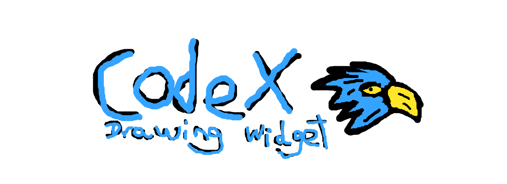

# Drawing Tool XCode Challenge

## Project Completion Checklist

### Setup and Basic Structure
- [x] Set up Next.js project with TypeScript
- [x] Create basic file structure (pages, components, utils)
- [x] Set up Tailwind CSS

### Canvas Component
- [x] Create Canvas component
- [x] Implement basic drawing functionality
- [x] Set up canvas size and initial styles
- [x] Handle mouse events for drawing
- [x] Canvas behavior documentation

### Toolbar Component
- [x] Create basic Toolbar component structure
- [x] Implement tool selection functionality
- [x] Connect toolbar actions to Canvas component
- [x] Toolbar behavior documentation

### Color Picker Component
- [x] Create basic ColorPicker component structure (integrated into Toolbar)
- [x] Implement color selection logic
- [x] Connect color selection to Canvas component
- [x] Color picker behavior documentation

### Drawing Utilities
- [x] Implement basic utility functions (e.g., clearCanvas)
- [x] Implement blur algorithm
- [x] Utility functions behavior documentation

### State Management
- [x] Implement state management (using React hooks and prop passing)
- [x] Share drawing settings across components

### Tool Functionality
- [x] Implement brush tool
- [x] Implement blur tool
- [x] Create tool selection mechanism

### Additional Features
- [x] Implement brush size selection
- [x] Implement image upload functionality
- [x] Implement export functionality (save as PNG)
- [x] Implement undo/redo functionality

### Styling and Design
- [x] Implement basic styling with Tailwind CSS
- [x] Ensure UI matches Figma design (further refinement may be needed)

### Documentation
- [x] Create basic README.md
- [x] Add inline code documentation
- [x] Expand documentation for all components and features

### Deployment
- [x] Set up deployment pipeline
- [x] Deploy to hosting service

### Final Review
- [ ] Perform final testing
- [ ] Ensure all requirements are met

## Recent Updates
- Complete documentation for all components and features
- Refine UI to match Figma design more closely
- Set up deployment and publish the project
- Implemented undo/redo functionality
- Added image upload functionality
- Integrated image drawing on canvas
- Updated Canvas component to use forwarded refs
- Modified page component to handle image upload
- Implemented save functionality (export as PNG)
- Integrated canvas history management for undo/redo operations
